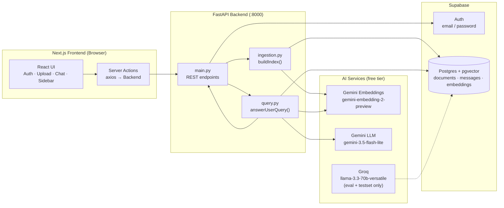
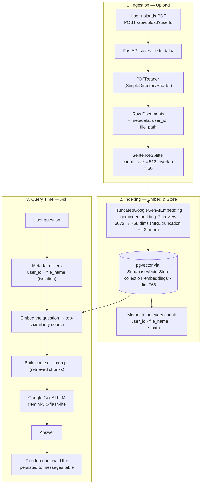
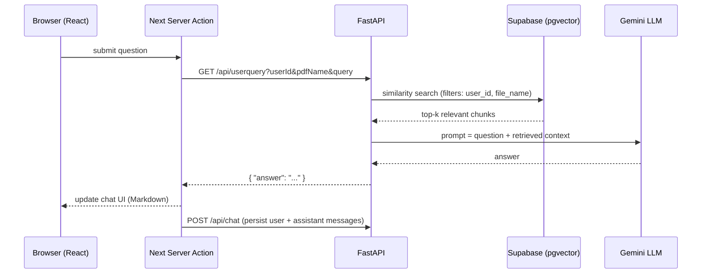

# ChatPDF

**Chat with your PDF documents using AI** — a full-stack Retrieval-Augmented Generation (RAG) application with per-user document isolation, persistent chat history, and an evaluation pipeline to measure RAG quality.

Built with a **Next.js + FastAPI** stack, **LlamaIndex** for the RAG pipeline, **Supabase (Postgres + pgvector + Auth)** for storage, **Google Gemini** for embeddings & generation, and **Ragas + Groq** for testset generation and offline evaluation.

---

## Table of Contents

- [Overview](#overview)
- [Features](#features)
- [Tech Stack](#tech-stack)
- [Architecture](#architecture)
  - [High-Level Architecture](#high-level-architecture)
  - [RAG Pipeline](#rag-pipeline)
  - [Request Flow](#request-flow)
- [Project Structure](#project-structure)
- [Prerequisites](#prerequisites)
- [Setup & Run Locally](#setup--run-locally)
  - [1. Supabase Setup](#1-supabase-setup)
  - [2. Backend Setup](#2-backend-setup)
  - [3. Frontend Setup](#3-frontend-setup)
  - [4. Run It](#4-run-it)
- [How It Works (Step by Step)](#how-it-works-step-by-step)
- [Evaluation Pipeline](#evaluation-pipeline)
- [API Reference](#api-reference)
- [Deployment](#deployment)
- [Roadmap](#roadmap)

---

## Overview

ChatPDF lets users upload PDFs, then ask natural-language questions about them. The system:

1. **Ingests** the PDF, splits it into chunks, and embeds each chunk into a vector store.
2. **Indexes** the embeddings in Supabase's `pgvector`, tagged with the owning user and file.
3. **Answers questions** by retrieving the most relevant chunks and passing them, plus the question, to an LLM.
4. **Remembers** the conversation — every message is saved per document and restored when you reopen it.

Only free-tier AI providers are used: **Google Gemini** (embeddings + answer generation) and **Groq** (LLM for testset generation & evaluation).

---

## Features

- **Email/password authentication** via Supabase Auth, with route protection through Next.js proxy.
- **PDF upload** with drag-and-drop, client & server-side **5 MB** validation, and a guided upload/ready state machine.
- **Per-user, per-document isolation** — every query is filtered by `user_id` + `file_name` before retrieval.
- **RAG chat** with Markdown-rendered answers, typing indicator, resend & copy message actions.
- **Persistent chat history** — messages stored in a `messages` table and restored per PDF on reload.
- **Session persistence** — the selected PDF survives page reloads via `localStorage`.
- **Message timestamps** — each bubble shows the date & time it was created.
- **PDF management** — sidebar listing your documents, with per-file deletion that also removes embeddings.
- **Evaluation suite** — offline RAG evaluation with **Ragas**: testset generation (Groq) + Context Recall, Faithfulness, Factual Correctness, and Answer Relevancy metrics.

---

## Tech Stack

### Frontend
| Technology | Purpose |
|---|---|
| **Next.js 16** (App Router) + **React 19** | UI framework |
| **TypeScript** | Type safety |
| **Tailwind CSS 4** | Styling |
| **@supabase/ssr** | Auth & SSR session handling |
| **Axios** | Backend calls from Server Actions |
| **react-markdown** | Render LLM answers |

### Backend
| Technology | Purpose |
|---|---|
| **FastAPI** + **Uvicorn** | REST API |
| **LlamaIndex** (0.14) | Document loading, chunking, vector index, query engine |
| **Supabase / Postgres + pgvector** | Relational data + vector store |
| **Google GenAI** (`gemini-embedding-2-preview`) | Embeddings (truncated 3072 → 768 dims) |
| **Google GenAI** (`gemini-3.5-flash-lite`) | Answer generation |
| **Groq** (`llama-3.3-70b-versatile`) | Testset generation + evaluation LLM |
| **Ragas** (0.4.3) | RAG evaluation & testset generation |
| **python-dotenv** | Configuration |

---

## Architecture

### High-Level Architecture



### RAG Pipeline



**Step-by-step:**

**Ingestion (upload)**
1. The frontend sends the PDF (`FormData`) to `POST /api/upload?userId=...`.
2. FastAPI validates the size (≤ 5 MB), saves the file to `backend/data/`, and calls `buildIndex(userId)`.
3. `SimpleDirectoryReader` + `PDFReader` loads the PDF into raw `Document` objects, stamping each with `user_id` and `file_path` metadata.

**Indexing (embed & store)**
4. `SentenceSplitter` splits each document into chunks (`chunk_size=512`, `chunk_overlap=50`).
5. Each chunk is embedded with Google's `gemini-embedding-2-preview` (3072 dims). A custom `TruncatedGoogleGenAIEmbedding` truncates to the first 768 dimensions and L2-normalizes them (Matryoshka-style), matching the pgvector column dimension.
6. `SupabaseVectorStore` writes the vectors into the `embeddings` table in Supabase (pgvector), along with chunk text and `user_id`/`file_name` metadata.
7. A row is inserted into the `documents` table, and the temporary file is deleted.

**Query time (ask)**
8. The frontend calls `GET /api/userquery?userId=...&pdfName=...&query=...`.
9. `answerUserQuery()` rebuilds the `VectorStoreIndex` from the stored pgvector store and applies `MetadataFilters` for `user_id` + `file_name` — guaranteeing users only ever retrieve chunks from **their** copy of **that** PDF.
10. The question is embedded, and a similarity search returns the top-k matching chunks.
11. The chunks are assembled into a context-augmented prompt and sent to Gemini (`gemini-3.5-flash-lite`).
12. The answer is returned to the UI, rendered as Markdown, and both user & assistant messages are saved via `POST /api/chat`.

### Request Flow



---

## Project Structure

```
chatPdf/
├── backend/                      # FastAPI RAG backend
│   ├── app/
│   │   ├── main.py               # FastAPI app — all REST endpoints
│   │   ├── ingestion.py          # buildIndex(): load → chunk → embed → store
│   │   ├── query.py              # answerUserQuery(): retrieve + generate
│   │   ├── embeddings.py         # TruncatedGoogleGenAIEmbedding (768-dim)
│   │   ├── llm.py                # Gemini LLM + Groq (OpenAI-compatible) LLM
│   │   ├── db.py                 # Supabase client
│   │   ├── evaluator.py          # Ragas evaluation pipeline
│   │   └── utils/helper.py       # truncate_embedding() (MRL truncation)
│   ├── testset.py                # Ragas testset generation
│   ├── testset.json / .csv       # Generated test sets
│   ├── scores.csv                # Evaluation output
│   ├── data/                     # Temporary PDF storage (gitignored)
│   ├── requirements.txt
│   └── pyproject.toml            # FastAPI entrypoint (app.main:app)
│
├── frontend/                     # Next.js 16 frontend
│   ├── app/
│   │   ├── page.tsx              # Main app (upload, chat, sidebar)
│   │   ├── auth/page.tsx         # Sign in / sign up
│   │   ├── layout.tsx            # Root layout
│   │   ├── globals.css           # Tailwind + theme
│   │   └── lib/
│   │       ├── auth.ts           # Sign-up / sign-in helpers
│   │       ├── actions/          # Server Actions (axios → backend)
│   │       ├── supabase/         # client / server / proxy helpers
│   │       └── utils/formatTime.ts
│   ├── proxy.ts                  # Auth route protection
│   ├── .env                      # NEXT_PUBLIC_SUPABASE_*, BACKEND_URL
│   └── package.json
│
└── vercel.json                   # Monorepo deployment config
```

---

## Prerequisites

- **Python 3.12+**
- **Node.js 18+** (npm)
- **Supabase project** — with the Postgres **`pgvector`** extension enabled
- **Google Gemini API key** (free tier) — used for embeddings & answer generation
- **Groq API key** (free tier) — used for testset generation & evaluation

---

## Setup & Run Locally

### 1. Supabase Setup

Create a Supabase project and, in the SQL editor, run:

```sql
-- Enable pgvector
create extension if not exists vector;

-- Documents (one row per uploaded PDF)
create table if not exists public.documents (
  id uuid primary key default gen_random_uuid(),
  user_id uuid not null,
  file_name text not null,
  created_at timestamptz default now()
);

-- Chat messages (one row per message, linked to a document)
create table if not exists public.messages (
  id uuid primary key default gen_random_uuid(),
  document_id uuid not null references public.documents(id),
  role text not null,
  content text,
  created_at timestamptz default now()
);

-- Embeddings table created by llama-index-vector-stores-supabase on first run
-- (collection name: 'embeddings', dimension 768)

-- RPC used by DELETE /api/pdf to purge a file's vectors
create or replace function public.delete_embeddings(p_file_name text, p_user_id text)
returns void
language sql
as $$
  delete from embeddings
  where (metadata ->> 'file_name') = p_file_name
    and (metadata ->> 'user_id') = p_user_id;
$$;
```

> The `embeddings` table itself is created automatically by LlamaIndex's `SupabaseVectorStore` the first time you ingest a document (collection name `embeddings`, dimension `768`).

### 2. Backend Setup

```bash
cd backend

# Create & activate a virtual environment
python -m venv venv
source venv/bin/activate

# Install dependencies
pip install -r requirements.txt
```

Create a `.env` file in `backend/`:

```env
# Supabase
SUPABASE_URL=https://<your-project>.supabase.co
SUPABASE_KEY=<service_role_key>            # service role key (bypasses RLS)
DATABASE_URL=postgresql://postgres.<host>:<password>@aws-0-<region>.pooler.supabase.com:6543/postgres

# Google Gemini (free tier)
GEMINI_API_KEY=<your-gemini-api-key>

# Groq (free tier) — testset generation & evaluation
GROQ_API_KEY=<your-groq-api-key>

# Frontend origin (CORS)
FRONTEND_URL=http://localhost:3000
```

### 3. Frontend Setup

```bash
cd frontend

npm install
```

Create a `.env` file in `frontend/`:

```env
NEXT_PUBLIC_SUPABASE_URL=https://<your-project>.supabase.co
NEXT_PUBLIC_SUPABASE_KEY=<anon_or_publishable_key>
BACKEND_URL=http://localhost:8000
```

### 4. Run It

```bash
# Terminal 1 — backend (from backend/)
cd backend
source venv/bin/activate
uvicorn app.main:app --reload --port 8000

# Terminal 2 — frontend (from frontend/)
cd frontend
npm run dev
```

Open **http://localhost:3000**, sign up, upload a PDF, and start asking questions.

---

## How It Works (Step by Step)

1. **Auth** — Sign up / sign in with email & password. Next.js proxy redirects unauthenticated users to `/auth`.
2. **Upload** — Drag & drop (or browse) a PDF. The client validates type + 5 MB size, then `uploadData()` posts it to FastAPI.
3. **Index** — The backend runs the full ingestion pipeline (load → chunk → embed → store in pgvector) and registers the document.
4. **Select** — Choose a PDF from the sidebar. The app fetches its chat history from the `messages` table and restores the conversation; the selection is saved to `localStorage` so it survives reloads.
5. **Ask** — Type a question. The frontend optimistically shows your message, calls `sendQuery()`, and streams the answer in once ready. Both messages are persisted.
6. **Manage** — Delete a PDF to remove its vectors (via the `delete_embeddings` RPC) and its document row.

---

## Evaluation Pipeline

The project includes an offline RAG evaluation workflow using **Ragas 0.4.3**.

### 1. Generate a Testset

`backend/testset.py` generates Q/A pairs from your PDFs:

- **LLM:** Groq `llama-3.3-70b-versatile` (OpenAI-compatible client → `api.groq.com/openai/v1`).
- **Embeddings:** Google Gemini via `embedding_factory("google", client=genai.Client(...))`.
- Outputs `testset.json` / `testset.csv` (each sample: `user_input`, `reference`, `reference_contexts`, persona/style/length metadata).

```bash
cd backend
source venv/bin/activate
# place PDFs in backend/data/ first
python testset.py
```

### 2. Evaluate the Pipeline

`backend/app/evaluator.py` runs every testset question through the real RAG pipeline (query engine → pgvector), collects `response` + `retrieved_contexts`, and scores it with:

- **Context Recall** (`ragas.metrics._context_recall`)
- **Faithfulness** (`ragas.metrics._faithfulness`)
- **Factual Correctness** (`ragas.metrics._factual_correctness`)
- **Answer Relevancy** (`ragas.metrics._answer_relevance`) — embeddings supplied via `LangchainEmbeddingsWrapper(GoogleGenerativeAIEmbeddings(...))`

```bash
cd backend
source venv/bin/activate
# uses testset_light.json by default; set the path at the top of the file if needed
cd app && python evaluator.py
```

> **Note:** metrics are imported from ragas's private `ragas.metrics._*` modules (not `ragas.metrics.collections`) because the collections variants don't subclass `Metric` and fail the `isinstance` check in ragas 0.4.3.

---

## API Reference

| Method | Endpoint | Description |
|---|---|---|
| `GET` | `/` | Health check |
| `POST` | `/api/upload?userId=` | Upload PDF + build/append index |
| `GET` | `/api/userquery?userId=&pdfName=&query=` | Ask a question (RAG) |
| `GET` | `/api/getpdfs?userId=` | List user's PDFs (requires `Authorization: Bearer <token>`) |
| `DELETE` | `/api/pdf?pdfId=&fileName=&userId=` | Delete document + its embeddings |
| `GET` | `/api/chat?chatId=` | Fetch a document's chat history |
| `POST` | `/api/chat` | Save a chat message (`user_id`, `document_id`, `role`, `content`) |

---

## Deployment

`vercel.json` configures a **monorepo deployment** on Vercel:

- `frontend` → Next.js app at the root.
- `backend` → FastAPI service (`backend/app/main.py`).
- Requests to `/api/backend/*` are rewritten to the backend service; everything else goes to the frontend.

When deploying, set the environment variables above in each service (Vercel project settings or `vercel env add`).

---

## Roadmap

- [ ] Stream responses for lower perceived latency.
- [ ] Multi-PDF chat (cross-document retrieval).
- [ ] Show retrieved sources/citations in the chat UI.
- [ ] Automated evaluation runs on each new ingestion.
- [ ] S3/object-storage for PDFs instead of a local temp directory.
